<h1 align="center" style="max-width: 100%;">
  <br/>
  <a href="https://www.prismfilmstudio.com">www.prismfilmstudio.com(배포중지)</a>
</h1>


<h3 align="center">
 프로젝트 최우수상 (1등) 수상 - 삼성전자<br /></h3>


###                                  

<p align="center">
  <b>SSAFY 1학기 최종 프로젝트(21.11.17 ~ 21.11.24)</b><br /></p>


<p align="center">
  <b>Supported</b><br/>
  <a href="#"></a>&nbsp;&nbsp;
  <a href="#"></a>&nbsp;&nbsp;
  <a href="#"></a>&nbsp;&nbsp;
  <a href="#"></a>&nbsp;&nbsp;
  <a href="#"></a>
</p>


<table style="table-layout: fixed; overflow-wrap: break-word;">
  <tbody>
    <tr>
      <td><a href="#" target="_blank"></a></td>
      <td><a href="#" target="_blank"></a></td>
      <td rowspan="2" style="display:flex-column;"><div style="height:15px;"></div></div>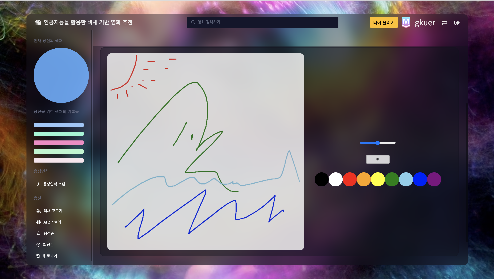</td>
    </tr>
    <tr>
      <td colspan="2"><a href="#" target="_blank"></a></td>
    </tr>
  </tbody>
</table>
<h6 align="center">
  www.prismfilmstudio.com <a href="#"></a>
</h6>


-----


## ✨ Stack

#### 주요  Stack

|                        Content                         |           Main            |                          Detail                          |
| :----------------------------------------------------: | :-----------------------: | :------------------------------------------------------: |
|               [**음성인식**](#음성인식 )               | Python 3.9.6 / JavaScript |             webkitSpeechRecognition / Axios              |
|                 [**드로잉**](#드로잉)                  |        JavaScript         |                Canvas / Blob Data/ Axios                 |
|                       [**FE**]()                       |  HTML / CSS / JavaScript  |            Django 3.2.9 / HTML5 / CSS3 / ES6             |
|         [**클러스터링**](#색채-데이터-만들기)          |  C# .Net Framework 4.7.2  |            C#(OpenCvSharp4 - V4.5.3.20210817)            |
| [**RGB Calculating**](#알고리즘-구성-및-웹페이지-작업) |       Python 3.9.6        |                       Python(Math)                       |
|                     [**DB**](#db)                      |       Python 3.9.6        |                    Python(Shell_plus)                    |
|           [**Query 최적화**](#query-최적화)            |       Django 3.2.9        |      prefetch_related / annotate / filter / exclude      |
|                   [**배포**](#배포)                    |            AWS            | EC2(Ubuntu Server 18.04 LTS) / Cloud9 / Gunicorn / NGINX |


#### 기본 Stack

|       ent        |      Page       |                         Description                          |
| :--------------: | :-------------: | :----------------------------------------------------------: |
|       User       |    accounts/    |                 회원가입 / 로그인 / 로그아웃                 |
|   예고편 보기    |     detail/     |          영화 포스터 누를 시, 예고편 팝업 자동재생           |
|   색채 고르기    |     choice/     |                  추천 받고 싶은 색채 고르기                  |
|   평점순 정렬    |      base/      | TMDB 평점 순으로 정렬 / 한줄평\|리뷰 남길시 추천 안하도록 구성 |
|   최신순 정렬    |      base/      | 개봉일 최신 순으로 정렬 / 한줄평\|리뷰 남길시 추천 안하도록 구성 |
| 이전 색채로 정렬 |      base/      | AI Z Score 순으로 정렬 / 한줄평\|리뷰 남길시 추천 안하도록 구성 |
| 사용자 평균 평점 |     detail/     |        영화에 대해 유저가 남긴 평균 평점 계산 및 출력        |
| 영화 키워드 검색 |      base/      | 검색 기능으로 제목 > 내용에 키워드 포함여부에 따라 정렬해서 출력 |
|   퀴즈 만들기    |  quiz_create/   |      사용자가 영화에 대한 그림 퀴즈를 낼 수 있도록 구성      |
|    퀴즈 풀기     |      quiz/      | 사용자들끼리 문제를 풀고 티어에 대한 점수를 얻을 수 있도록 구성 |
|  평점 및 한줄평  | movie_comment/  |       영화에 대한 별점과 한줄평을 남길 수 있도록 구성        |
|   리뷰(+그림)    |     review/     |           그림을 그리며 리뷰를 남길 수 있도록 구성           |
|   리뷰 속 댓글   | review_comment/ |             리뷰마다 댓글을 남길 수 있도록 구성              |
|    유저 티어     |      tier/      | 브론즈부터 마스터까지 리뷰 작성, 문제 풀이 등에서 점수 획득  |
| 영화 Frame 확대  |     detail/     | detail 페이지에서 영화에 대한 프레임 클릭시  Modal로 확대 출력 |


## 📦 Structure


```
final-pjt
├── accounts/
│   ├── migrations
│		│		└── ...
│   ├── templates/accounts
│		│		└── ...
│   └── static/accounts
│				└── ...
├── movies/
│   ├── migrations
│		│		└── ...
│   ├── templates/movies
│		│		└── ...
│   └── static/movies
│				└── ...
├── final-pjt/
│		└── ...
├── staticfiles/static
│   ├── css
│		│		└── ...
│   ├── favicon
│		│		└── ...
│   ├── images
│		│		└── ...
│   ├── videos
│		│		└── ...				
│   └── ...
├── templates
│   └── base.html
├── .gitignore
├── README.md
├── db.sqlite3
└── requirements.txt
```


## 🏃 팀원 정보 및 업무 분담 내역
#### 소속
* ##### SSAFY

#### 이름
- ##### Eora

  - 클러스터링 / RGB Calculating / Tier / Quiz / DB / 쿼리 최적화 / FE 

- ##### Gkuer

  - 음성인식 / 드로잉 / Design / Quiz / DB / FE / 쿼리 최적화 / 배포


## ⚙️ 개요

* ##### 목표 서비스 구현 및 실제 구현 정도

  * 90%
    * 목표 서비스 구현
    * 목표 디자인 구현
    * 속도: -10%, 쿼리 최적화, Static 및 DB 경량화 완료하였지만, 드로잉에 활용되는 Media File에 대한 경량화가 이루어지지 않음

* ##### 목차

  * Part 1, Eora
  * Part 2, Gkuer
  * 마치며


## 🏃 Part 2, Gkuer

> SSAFY 1학기의 마무리, SSAFY에서 처음하는 프로젝트,
>
> 잘하고 싶었다. 원하는 모든 것을 구현하기 위해 집중했다.


### `음성인식`

> 기존에는 네이버, 카카오 둘 중 하나의 API를 사용해서 Axios, Promise 방식으로 API / Django View 2개와 통신하여 로직을 처리하려고 구상
>
> 하지만, IE와 Chrome에서 동작하는 Web Speech API의 음성인식 신뢰도(한국어, 92%)을 확인 후 해당 API 사용에 접근


> CSR = Naver CLOVA Speech Recognition, K_TTS = Kakao Speech-to-Text system, WSA = Web Speech API


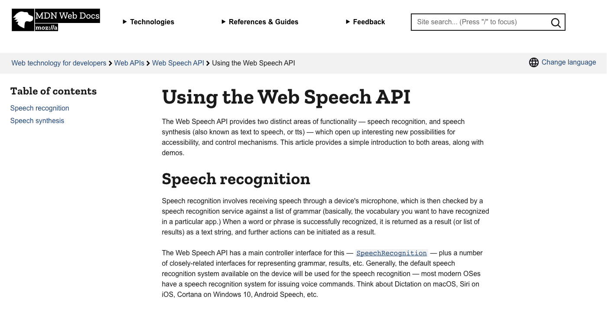

#### Web Speech API 선정

* 한국어 신뢰도 순은 CSR > K_TTS > Web Speech API

* 처리해야 하는 로직순서는

  * CSR, K_TTS의 경우,
    * Template(사용자 음성 녹음) > Axios(JS, 파일로 변환 후 전송) > CSR, K_TTS(데이터 처리후 Response) > Axios(데이터 수신) > Django View(데이터 전송) > Django View(데이터 처리 후 Response) > Axios(작업 후 Template처리)
  * WSA의 경우,
    * 사용자 음성 녹음(Template) > WSA(바로 처리 후 텍스트 추출 후 전송)  > Django View(데이터 처리 후 Response) > Axos(작업 후 Template처리)

  안 그래도 많은 데이터가 업로드 되어야하고, 통신도 많이 하는 사이트에서 CSR, K_TTS 보다는 WSA가 훨씬 가벼울 것이라 예측

* 구현 사이트에서 필요한 것은 어느정도의 인식률 이상

  음성인식 처리가 목적인 사이트가 아니며, 처리해야하는 요청이 많지 않았다. 따라서 WSA의 신뢰도 92%는 충분하다고 판단


#### HTML - Modal 이용, 팝업 호출

녹음 아이콘 / 정지 아이콘 기준으로 녹음 시작 / 정지 및 로직 시작을 Flag 처리

> 처리마다 아이콘 및 Answer Text 변경

```html
<div>
  <h4 id="voiceText"> 음성을 기다리고 있어요...</h4>
  <h4 class="d-none" id="voiceAnswer" > 알겠어요, 지금 바로 실행할게요.</h4>
</div>

<div class="modal-footer">
  <button id="voiceBtn" type="button" class="btn btn-danger">
    <i class="fas fa-microphone-alt"></i>
  </button>
</div>
```


#### WebRecognitionAPI & Axios & Python

* CDN - Webkit 안에 내장

* Instance - new webkitSpeechRecognition

* 텍스트 추출 - Instance 'result' 이벤트 리스너, event['results']의 index 0

* 텍스트 추출 후 로직
  * voice_process로 Axios 요청 
  * vocie_process 처리 후 Response
  * Axios에서 js로 template 조정

##### Voice Recognition Script

```javascript
 음성인식 
  <script src="https://unpkg.com/axios/dist/axios.min.js"></script>

  <script>
    // Required Definition
    const voiceBtn = document.querySelector('#voiceBtn')
    const voiceText = document.querySelector('#voiceText')
    const processURL = '/movies/voice_process/'
    const voiceAnswer = document.querySelector('#voiceAnswer')

    let speech = new webkitSpeechRecognition // Voice Recording Tool
    let flag = true // start|stop flag

    voiceBtn.addEventListener('click', function () {
      if (flag) {
        speech.start()
        voiceText.innerText = "듣고 있어요..."
        voiceBtn.innerHTML = '<i class="fas fa-stop" style="font-size:35px;"></i>'
        voiceAnswer.classList.add('d-none')
        flag = false
      } else {
        speech.stop()
        voiceBtn.innerHTML = '<i class="fas fa-microphone-alt" style="font-size:35px;"></i>'
        flag = true
        
        // Connecting to voice_process in View
        axios({
          method: 'GET',
          url: processURL,
          params: {
            data: voiceText.textContent,
          }
        })
          .then(function (response) {
            const res = response.data.res // Number for Recognition
            if (res != 0 && res <= 3) {
                // href to Main by Sorting
              voiceAnswer.classList.remove('d-none')
              voiceAnswer.innerText = "알겠어요, 바로 실행할게요."
              setTimeout(function() {
                window.location.href = `/movies/index/${res}`
              }, 1000);  
            } else if (res >= 4) {
              if (res == 4) {
                // Search
                let query = response.data.query
                const searchInput = document.querySelector('#searchInput')
                const searchButton = document.querySelector('#searchButton')
                searchInput.value = query
                voiceAnswer.classList.remove('d-none')
                voiceAnswer.innerText = "알겠어요, 바로 실행할게요."
                setTimeout(function() {
                  searchButton.click()
                }, 1000);
              } else if (res == 5) {
                // Click BackBtn
                voiceAnswer.classList.remove('d-none')
                voiceAnswer.innerText = "알겠어요, 바로 실행할게요."
                setTimeout(function() {
                  let backTag = document.querySelector('#backTag')
                  backTag.click()
                }, 1000);
              } else if (res == 6) {
                // About UserInfo Update
                voiceAnswer.classList.remove('d-none')
                voiceAnswer.innerText = "알겠어요, 바로 실행할게요."
                setTimeout(function() {
                window.location.href = '/accounts/logout'
              }, 1000);
              }
            } else {
              voiceAnswer.classList.remove('d-none')
              voiceAnswer.innerText = "해당 서비스는 준비중입니다."
            }
          })
        }})
    
    // Recording Response Tracking
    speech.addEventListener("result", function (event) {
      const { transcript } = event["results"][0][0]
      voiceText.innerText = `"${transcript}"`
    })
  </script>
```

#### 

##### voice_process

```python
# movies/views.py

def voice_process(request):
    data = request.GET['data']
    responsable = {"메인": 1, "매인": 1, "색체": 1, "색채": 1, "평점": 2, "최신": 3, "검색": 4, "뒤로":5, "로그": 6}
    res, query = 0, ""
    
    for key, value in responsable.items():
        if key in data:
            if key == "검색":
                query = str(data[1:data.index("검색")])
            res = value
            break
        
    context = {
        'res' : res,
        'query' : query,
    }
    return JsonResponse(context)
```


### `드로잉`

> 사용자 로컬에 저장하지 않고 데이터를 바로 전송하기 위해 Blob 데이터 변환 후, FormData 생성 후 Views.py 처리, Json Response, Axios Promise 동작


##### 그림판

* https://github.com/shlee0882/painting-js 이용 및 응용
* 사용자가  그릴 수 있는 컬러는 영화의 컬러 색상으로 한정


##### HTML - Modal 이용, 팝업 호출

스케치북 열기 버튼을 통해 그림판 display 토글

> 해당 flag로 그림 데이터 없을 경우 그림이 없는 것으로 처리

```html
<div class="content-section mt-3">
  <div class="app-card mt-5">
    <button style="background: none; border:none;" id="drawBtn">
      <h1 style="color:white;">스케치북 열기</h1>
    </button>
  </div>
</div>

<div class="content-section d-none" id="drawWindow">
  <div class="app-card mt-3">
    <div class="row d-flex justify-content-center align-items-center">
      <canvas id="drawCanvas" class="canvas col-6" style="opacity: 0.8;"></canvas>
      <div class="controls col-5">
        <div class="controls__range">
          <input type="range" id="jsRange" min="0.1" max="10.0" value="5.0" step="0.1" style="width:200"/>
        </div>
        <!-- div.controls__btns>button#jsMode+button#jsSave -->
        <div class="controls__btns">
          <button id="jsMode" style="opacity: 0.8;">펜</button>
        </div>
        <div class="controls__colors" id="jsColors">
          
          <div class="controls__color jsColor" style="background-color: rgb({{color.color_1_R}},{{color.color_1_G}},{{color.color_1_B}});"></div>
          <div class="controls__color jsColor" style="background-color: rgb({{color.color_2_R}},{{color.color_2_G}},{{color.color_2_B}});"></div>
          <div class="controls__color jsColor" style="background-color: rgb({{color.color_3_R}},{{color.color_3_G}},{{color.color_3_B}});"></div>
          <div class="controls__color jsColor" style="background-color: rgb({{color.color_4_R}},{{color.color_4_G}},{{color.color_4_B}});"></div>
          <div class="controls__color jsColor" style="background-color: rgb({{color.color_5_R}},{{color.color_5_G}},{{color.color_5_B}});"></div>
          
        </div>
      </div>
    </div>
  </div>
</div>
```


##### Draw Script

* Reference - https://github.com/shlee0882/painting-js)
* Reference 그대로 이용, 그림판을 생성하는 것이 목표가 아니였으므로 오픈소스 CSS 활용과 같다고 판단


##### Blob 데이터 변환 & FormData 생성 & Axios

* Blob 데이터 변환 및 FormData 생성 이유
  * 사용자 로컬에 저장하지 않고 파일을 미디어 파일에 업로드 >> Blob 데이터 변환 후 데이터 PUSH
  * input에 데이터 값을 JS로 변경할 수 없는 정책 >> 새로운 FormData 생성후 해당 데이터 POST

```javascript
function submitFunc(){
  event.preventDefault()
  let drawCanvas = document.querySelector('#drawCanvas')
	
  data = new FormData()                                                           	// FormData 생성
	

  var imgDataUrl = drawCanvas.toDataURL('image/png');
  var binaryData = atob(imgDataUrl.split(',')[1]);                           	 	   // Blob 데이터 변환
  var array = [];
  for (var i = 0; i < binaryData.length; i++) {
    array.push(binaryData.charCodeAt(i));
  }
  var blob = new Blob([new Uint8Array(array)], {type: 'image/png'});


  const title = document.querySelector('#title')
  const content = document.querySelector('#content')
  const moviePk = "{{movie.pk}}"
  if (drawBtnFlag) {
  } else {
    data.set('draw', blob, 'my_draw.png')
  }
  data.set('title', title.value)
  data.set('content', content.value)
	
  axios({                                                           								// Axios
    url: '',
    method: 'POST',
    data: data,
    headers: {"X-CSRFToken": csrfToken, "Content-Type": "multipart/form-data" },
  })
    .then(response => {
      window.location.href = `/movies/detail/${moviePk}/`
    })
    .catch(err => {
      alert("작성 값에 이상이 있어요")
    })
}
```

#### 

##### review_create / quiz_create

```python
@login_required
@require_http_methods(['GET','POST'])
def review_create(request, movie_pk):
    movie = Movie.objects.get(pk = movie_pk)
    
    # Profile Color Create
    colors = request.user.usercolorrecord_set.all()                # Color List
    last_color = colors[len(colors)-1]                             # Picked Color
    colors = reversed(colors)                                      # Color Sort(Recently)
    
    if request.method == "POST":
        form = ReviewForm(request.POST, request.FILES)
        if form.is_valid():
            review = form.save(commit=False)
            review.movie = movie
            review.user = request.user
            review.save()
            request.user.point += 30
            request.user.save()
            return redirect('movies:detail', movie_pk)
    else:
        form = ReviewForm()
    context = {
        'movie': movie,
        'form': form,
        'last_color': last_color,
        'colors': colors,
    }
    return render(request, 'movies/review_create.html', context)
  
@login_required
@require_http_methods(['GET','POST'])
def quiz_create(request):
    # Profile Color Create
    colors = request.user.usercolorrecord_set.all()                # Color List
    last_color = colors[len(colors)-1]                             # Picked Color
    colors = reversed(colors)                                      # Color Sort(Recently)
    
    movies = Movie.objects.all()
    
    if request.method == "POST":
        form = QuizForm(request.POST, request.FILES)
        if form.is_valid():
            quiz = form.save(commit=False)
            quiz.user = request.user
            quiz.save()
            request.user.point += 30
            request.user.save()
            return redirect('movies:index', 2)
    else:
        form = QuizForm()
    context = {
        'form': form,
        'last_color': last_color,
        'colors': colors,
        'movies': movies,
    }
    return render(request, 'movies/quiz_create.html', context)
```


### `Quiz`

##### 퀴즈 풀이 화면

* 사용자별로 맞춘 문제는 보이지 않음

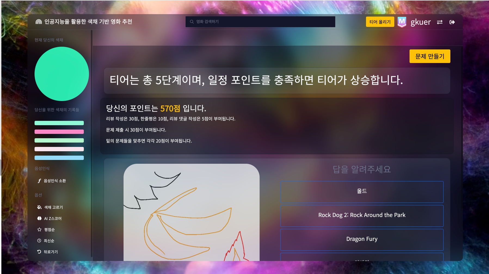

* Axios와 quiz_check(views.py) 처리

> 문제의 pk와 제출된 value pk 를 비교

* JS Code

```javascript

<script>
  const forms = document.querySelectorAll("#answerForm")
  const csrfToken = document.querySelector('[name=csrfmiddlewaretoken]').value

  for(const form of forms){
    form.addEventListener("submit", function (event) {
      event.preventDefault()
      const questionPk = event.target.dataset.questionPk
      const answer = event.submitter.value

      axios({
        method: 'post',
        url: '/movies/quiz_check/',
        headers: {'X-CSRFToken': csrfToken},
        data: {
          test: "Test",
          question_pk: `${questionPk}`,
          answer: `${answer}`,
        }
      })
        .then(function (res) {
          const correct = res.data.correct
          const main = document.querySelector(`#main${questionPk}`)
          const right = document.querySelector(`#right${questionPk}`)
          const wrong = document.querySelector(`#wrong${questionPk}`)

          if (correct) {
            main.classList.add('d-none')
            right.classList.remove('d-none')
          } else {
            main.classList.add('d-none')
            wrong.classList.remove('d-none')
          }
        })
        .catch(function (err) {
          console.log(err)
        })
    })
  } 
</script>

```

* quiz_check.py

```python
@login_required
@require_http_methods(['GET','POST'])
def quiz_check(request):
    post_body = json.loads(request.body.decode('utf-8'))
    
    question_pk = post_body.get('question_pk')
    answer = post_body.get('answer')

    quiz = Quiz.objects.get(pk=question_pk)
    correct = False

    if int(quiz.movie.pk) == int(answer):
        print("정답")
        correct = True
        
        request.user.point += 20
        quiz.correct_user.add(request.user)
        request.user.save()

    context = {
        "correct": correct,
    }

    return JsonResponse(context)
```


##### 퀴즈 만들기 화면

* 영화 선택 후, 문제를 그림판으로 그리고 바로 출제 가능

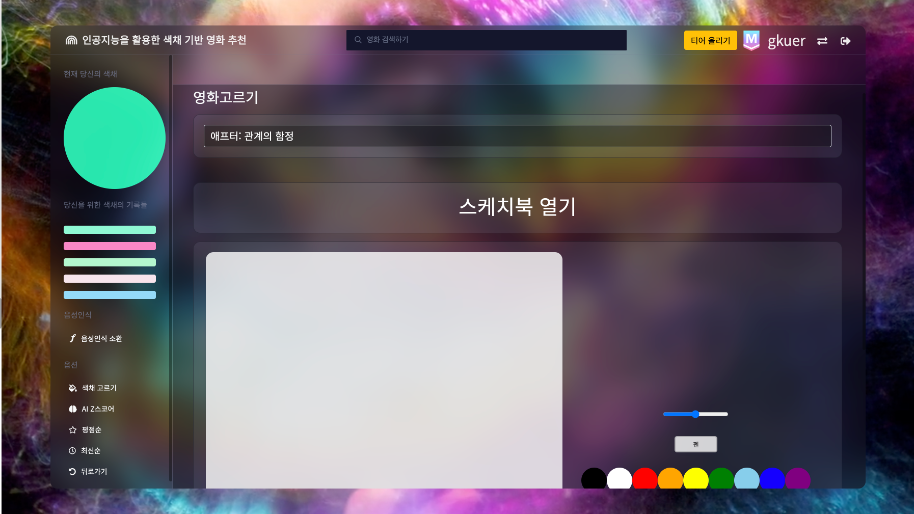

* 코드  - 상단 드로잉 참조


##### 퀴즈 버튼 제출시(비동기 업데이트)

* 맞추고 틀린 것에 따라 해당 문제가 체크되고 사용자가 스크롤을 내릴 수 있도록 UI 구성
* classList.add / remove d-none + promise 동작방식으로 구성

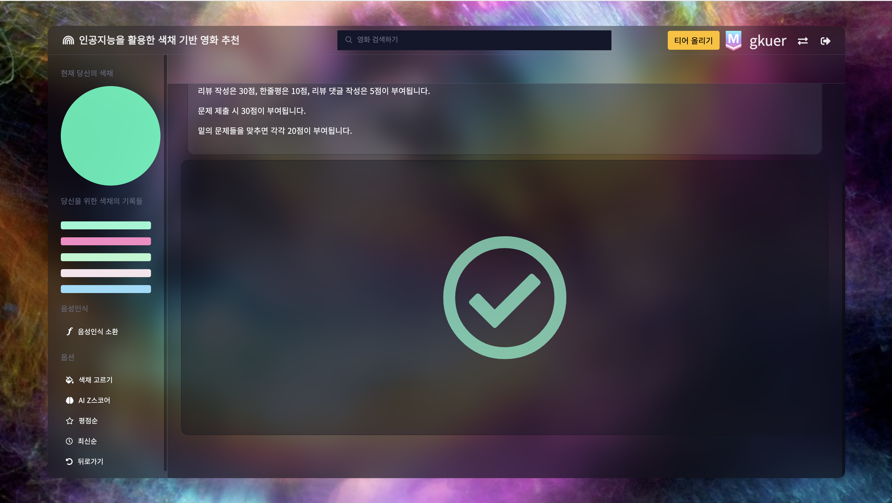

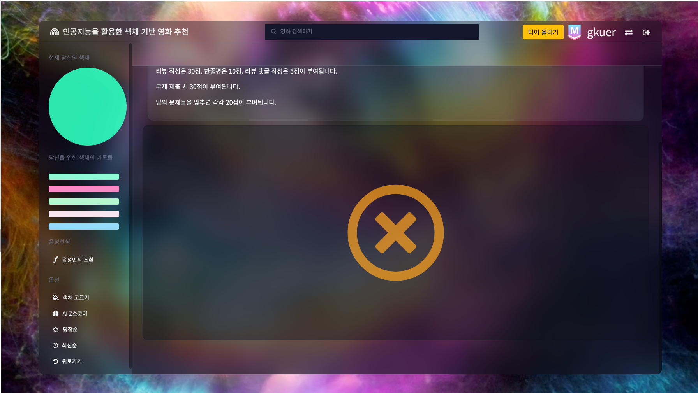


### `DB`

> ColorData, TMDB API(영화 정보), Youtube Data(trailer) 등이 들어감에 따라 새로운  DB를 만들 필요


##### DB Modeling

* 기능과 들어갈 데이터가 많은 만큼 규모가 있는 DataBase 생성
* BASE 데이터인 영화데이터는 직접 조합해서 PUSH 해야할 필요
  * 클러스터링 및 RGB 도출된 데이터
  * TMDB API 영화정보
  * Youtube Trailer URL 등


##### Frame 이미지 PUSH

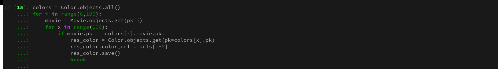


##### Color Model Database PUSH

* 만들어진 json 데이터를 Movie를 정참조 하고 있는 Color 모델에 PUSH

* 특정생 5개 RGB 데이터 PUSH
* 요소가 많으므로 작업 전 Python 이용
* 


* Result


##### TMDB API 호출 및 해당 데이터 PUSH

* Response 데이터

* 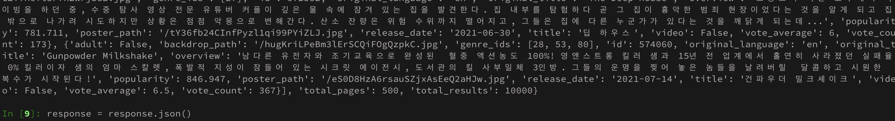

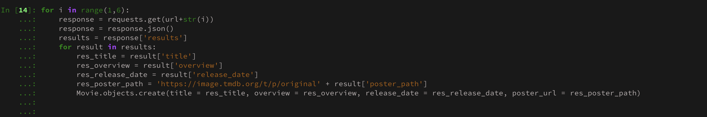


##### 기존에 Naver 평점을 API 호출하려 했으나, 영화제목 포함여부로 response를 주어서 TMDB 평점으로 변경

* Naver


* TMDB

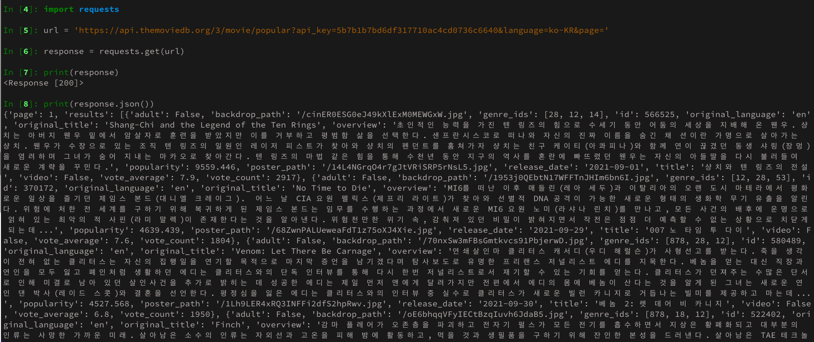

* Result

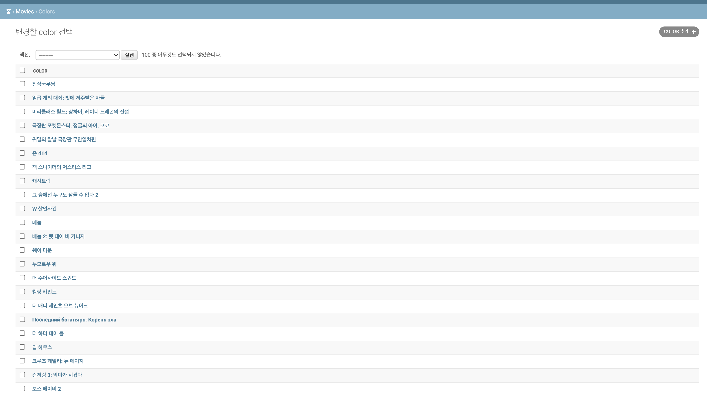


##### Youtube Trailer Link PUSH

* Iframe 예고편 작업 전 link PUSH


### `Query 최적화`

> 복잡한 모델구조로 역참조, 정참조 부분에서 중복 Query 발생


##### Query 최적화 작업 전 Index Page

* 408 Query / Time 7000ms ~ 9000ms


##### Query 최적화 작업 후 Index Page

* 9 Query / Time 250ms ~ 300ms (약 Query 1/40, Time 1/30 으로 경량화)


##### 사용 Stack

* ##### prefetched_realated - (역참조 데이터 사전 등록)

* ##### annotate - (count 사전 등록)

* ##### filter, exclude 등 - 계산 최적화

```python
# index/views.py

    # Exclude Already Watched Movies(Query Optimization)
    already_watched_movies = set()

    users_moviecomments = MovieComment.objects.filter(user=request.user.pk).values('movie')
    for users_moviecomment in users_moviecomments:
        already_watched_movies.add(users_moviecomment['movie'])

    users_reviews = Review.objects.filter(user=request.user.pk).values('movie')
    for users_review in users_reviews:
        already_watched_movies.add(users_review['movie'])

    # Query Optimization - movie.color_set + Exclude Already Watched Movies + movie.comments_set + movie.comments.all.count()
    movies = Movie.objects.prefetch_related('color_set','comments')\
            .annotate(comment_count=Count('comments'))\
            .exclude(id__in=already_watched_movies)
    
    res_movies = []
    
    # Order by TMDB_Grade + User_Grade
    if mode == 2:
        for movie in movies:
            naver_score = movie.naver_grade
            user_score = 0 
            for comment in movie.comments.all():
                user_score += comment.grade
            if user_score:
                user_score = round((user_score / movie.comment_count),1) * 2
                score = (naver_score + user_score) / 2
            else:
                score = naver_score
            res_movies.append([movie, score])
    
    # Order by Release Date
    elif mode == 3:
        for movie in movies:
            score = movie.release_date
            res_movies.append([movie, score])
    
    # Order by Search
    elif mode == 4:
        datas = request.GET['searchData'].split()                      # Input Data list
        for movie in movies:                                           # query in title : +10, query in overview +1
            temp_cnt = 0
            title = movie.title
            overview = movie.overview
            for data in datas:
                if data in title:
                    temp_cnt += 10
                if data in overview:
                    temp_cnt += 1
            if temp_cnt >= 1:                                          # If query in title, content, Can be Searched
                res_movies.append([movie,temp_cnt])

```


### `배포`

> AWS EC2(Ubuntu Server 18.04 LTS), Cloud9, Gunicorn, NGINX
>
> Django contains STATIC / MEDIA
>
> ##### https://www.prismfilmstudio.com

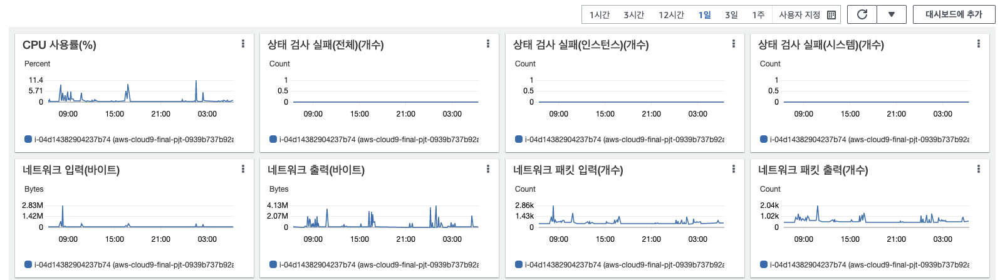


##### NGINX 설정

* static과 media files가 포함되어 있어 NGINX에서 접근하지 못하는 이슈가 발생(404)
* static은 경로를  staticfiles/static으로 잡아줘서 staticfiles/static 경로를 만들어 줌으로써 해결
* media 파일 접근의 경우에는 static 처럼 root로 잡아주면 에러가 발생
  * alias로 바꿔 media파일에 접근할 수 있도록 처리

```shell
   server_name 18.214.88.219 prismfilmstudio.com www.prismfilmstudio.com;

    location ^~ /static/ {
            root /home/ubuntu/pjt10/staticfiles/;
    }

    location ^~ /media/ {
            alias /home/ubuntu/pjt10/media/;
    }

    location / {
            include proxy_params;
            proxy_pass http://127.0.0.1:8000;
    }

listen 443 ssl; # managed by Certbot
ssl_certificate /etc/letsencrypt/live/prismfilmstudio.com/fullchain.pem; # managed by Certbot
ssl_certificate_key /etc/letsencrypt/live/prismfilmstudio.com/privkey.pem; # managed by Certbot
```


##### Django & Gunicorn 설정

* Django - STATIC ROOT, ALLOWED_HOSTS, collectstatic 명령
* Gunicorn 설정

```shell
[Unit]
Description=gunicorn daemon
After=network.target

[Service]
User=ubuntu
Group=www-data
WorkingDirectory=/home/ubuntu/pjt10
ExecStart=/home/ubuntu/pjt10/venv/bin/gunicorn \
        --workers 3 \
        --bind 127.0.0.1:8000 \
        pjt10.wsgi:application

[Install]
WantedBy=multi-user.target
```


##### 도메인 설정 & 포트 설정 & HTTPS

* www.~ 으로도 들어올 수 있도록 A type 하나 더 개방 

  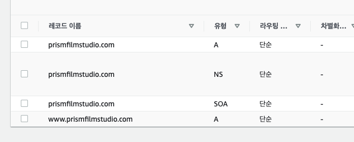

* 해당 설정에 따른 NGINX 설정
* HTTPS 설정

```shell
sudo snap install core; sudo snap refresh core
sudo snap install --classic certbot
sudo ln -s /snap/bin/certbot /usr/bin/certbot
sudo certbot --nginx
```

* 포트설정

* 80 / 8000 / 443(https) => 0.0.0.0/0 / ::/0 개방

  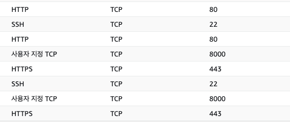


## 📖 Reference
formdata - https://developer.mozilla.org/ko/docs/Web/API/FormData

그림판 - https://github.com/shlee0882/painting-js

blob Data 변환 - https://codebb.tistory.com/22

배경 테마 - https://codepen.io/trending

Axios - https://github.com/axios/axios

Base -  https://edu.ssafy.com

컬러바코드 - https://happycoding.io/gallery/movie-colors/index

대표 색채 - https://airows.com/culture/color-palettes-from-famous-movie-scenes

티어 시스템 - https://www.acmicpc.net/, https://solved.ac/
