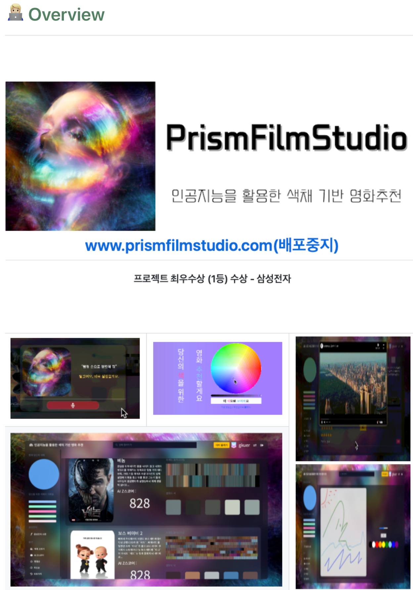
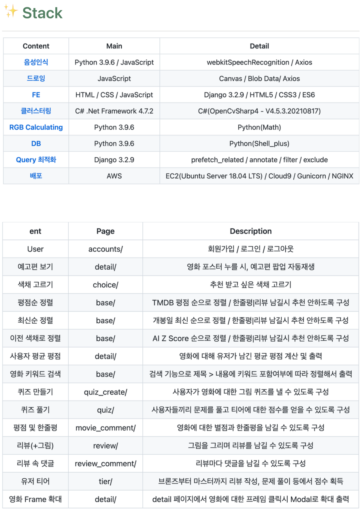
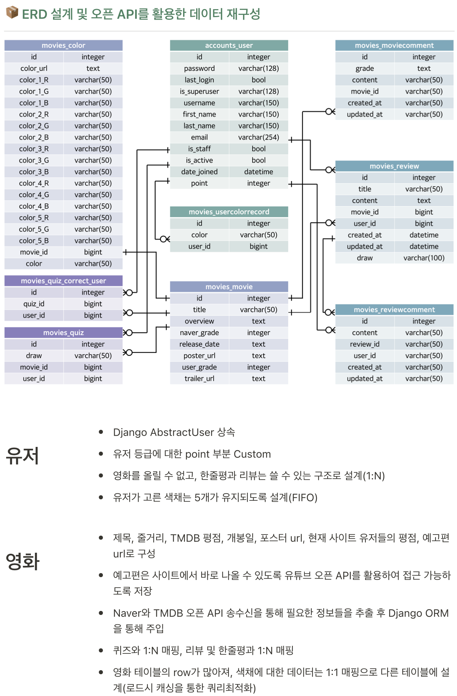
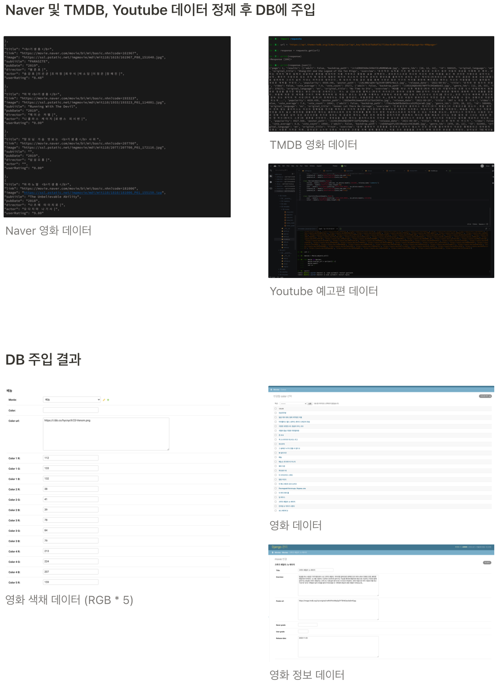
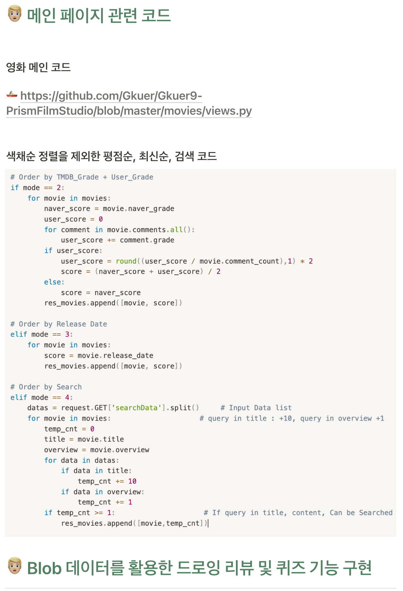
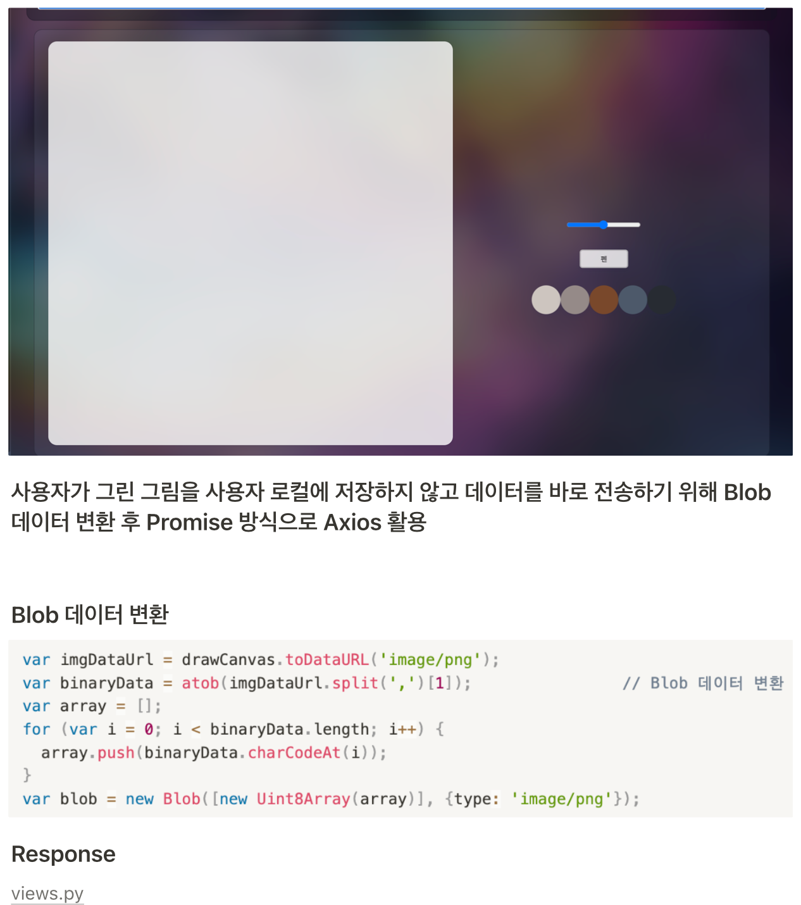
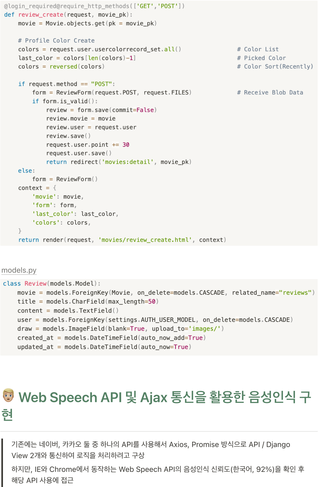
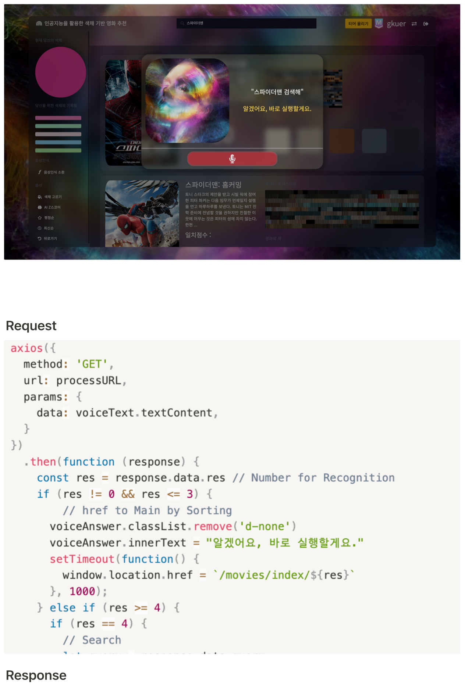
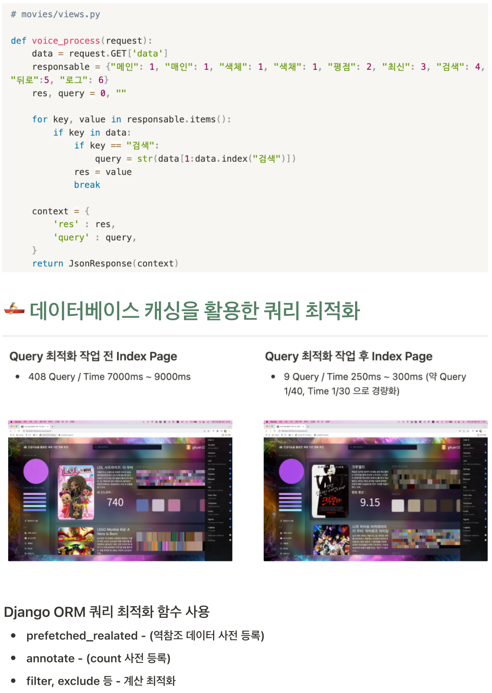
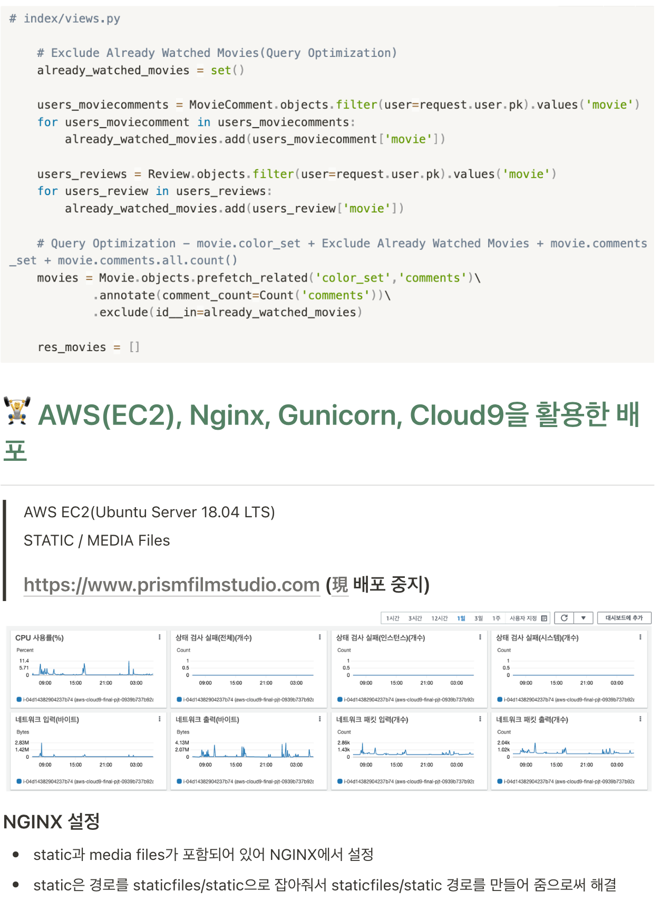

# 인공지능을 활용한 색채 기반 영화 추천, PrismFilm Studio

## 📖 Reference

formdata - https://developer.mozilla.org/ko/docs/Web/API/FormData

그림판 - https://github.com/shlee0882/painting-js

blob Data 변환 - https://codebb.tistory.com/22

배경 테마 - https://codepen.io/trending

Axios - https://github.com/axios/axios

Base -  https://edu.ssafy.com

컬러바코드 - https://happycoding.io/gallery/movie-colors/index

대표 색채 - https://airows.com/culture/color-palettes-from-famous-movie-scenes

티어 시스템 - https://www.acmicpc.net/, https://solved.ac/
