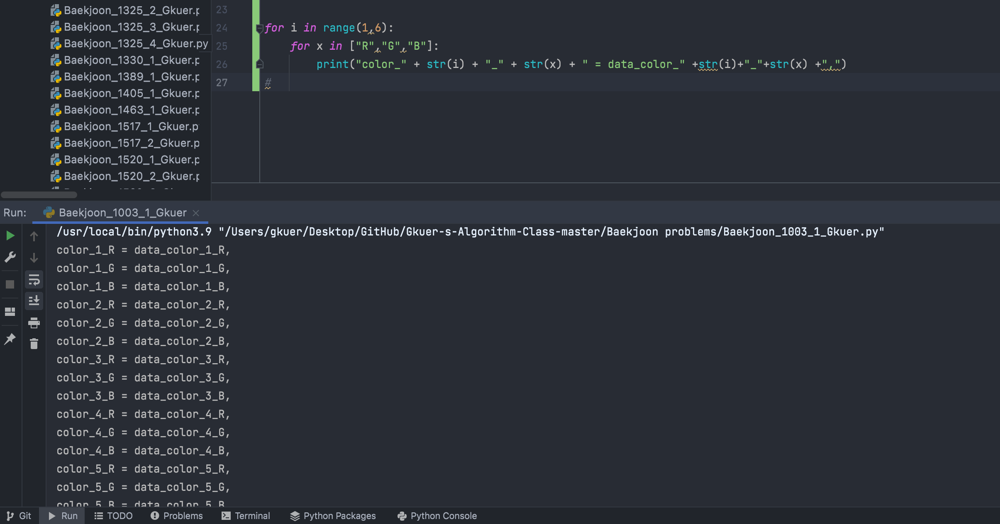
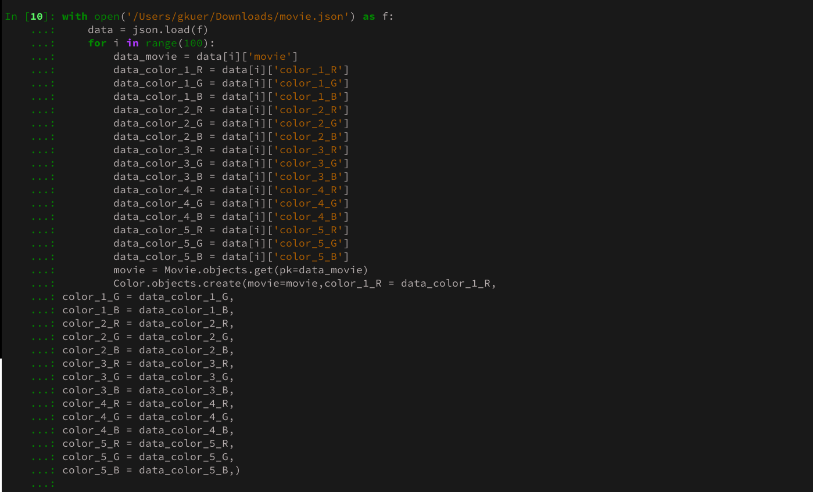
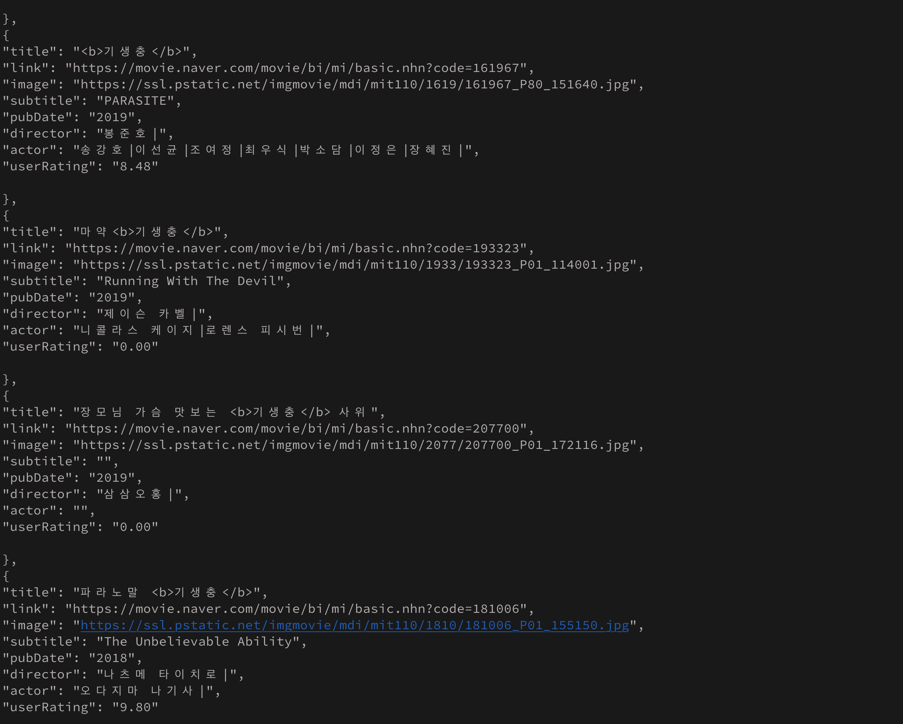
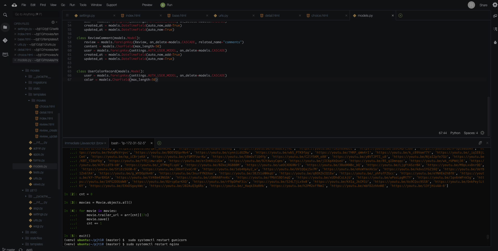
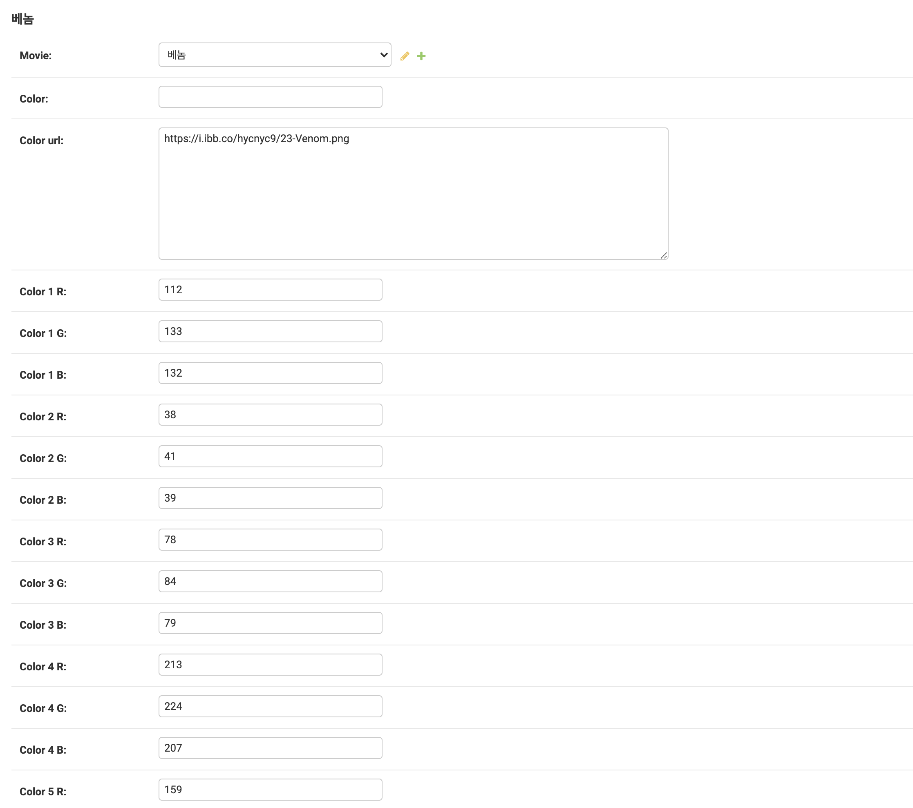
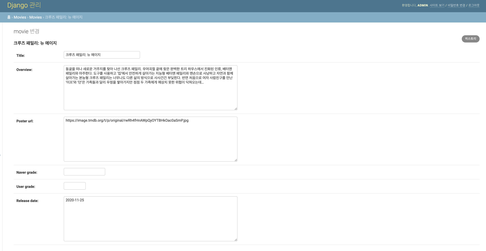
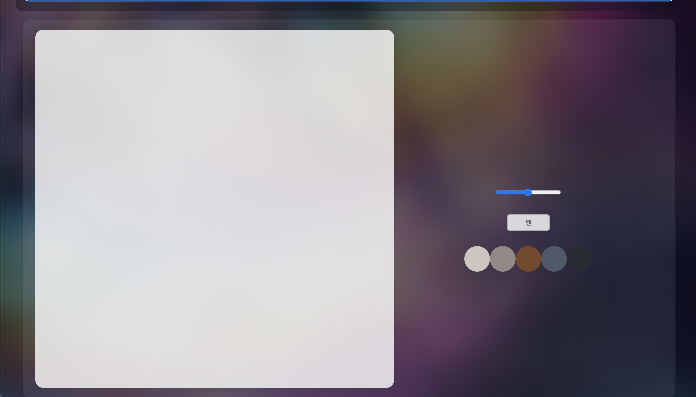
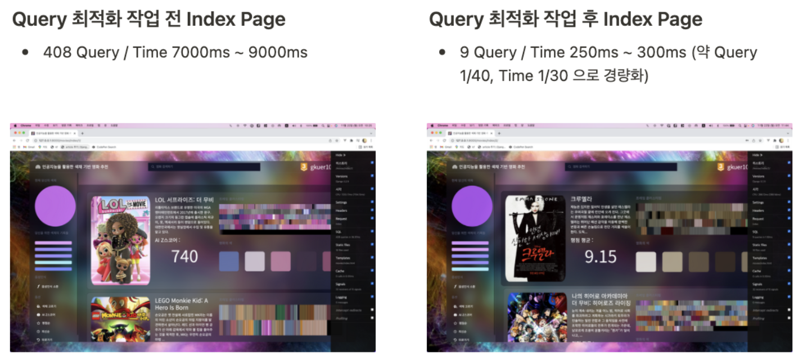

<h1 align="center" style="max-width: 100%;">
  <br/>
  <a href="https://www.prismfilmstudio.com">www.prismfilmstudio.com(배포중지)</a>
</h1>


<h3 align="center">
 프로젝트 최우수상 (1등) 수상 - 삼성전자<br /></h3>


###                                  

<p align="center">
  <b> </b><br /></p>


<p align="center">
  <b>Supported</b><br/>
  <a href="#"></a>&nbsp;&nbsp;
  <a href="#"></a>&nbsp;&nbsp;
  <a href="#"></a>&nbsp;&nbsp;
  <a href="#"></a>&nbsp;&nbsp;
  <a href="#"></a>
</p>


## 💁🏻 About Project

#### 경험하고, 성장한 것들 (2021.09 ~ 2021.11)

- ERD 설계 및 오픈 API를 활용한 데이터 재구성
- Python, Django ORM을 활용한 데이터 주입
- Blob 데이터를 활용한 드로잉 리뷰 및 퀴즈 기능 구현
- Web Speech API 및 Ajax 통신을 활용한 음성인식 구현
- 데이터베이스 캐싱을 활용한 쿼리 최적화
- AWS(EC2), Nginx, Gunicorn, Cloud9을 활용한 배포


#### 사용 기술 요약

- Python, Django, Django ORM
- Django Template, HTML5, CSS3, JS(ES6)
- Gunicorn, Nginx, AWS, EC2, Cloud9, HTTPS


-----


## ✨ Stack

#### 주요  Stack

|                        Content                         |           Main            |                          Detail                          |
| :----------------------------------------------------: | :-----------------------: | :------------------------------------------------------: |
|               [**음성인식**](#음성인식 )               | Python 3.9.6 / JavaScript |             webkitSpeechRecognition / Axios              |
|                 [**드로잉**](#드로잉)                  |        JavaScript         |                Canvas / Blob Data/ Axios                 |
|                       [**FE**]()                       |  HTML / CSS / JavaScript  |            Django 3.2.9 / HTML5 / CSS3 / ES6             |
|         [**클러스터링**](#색채-데이터-만들기)          |  C# .Net Framework 4.7.2  |            C#(OpenCvSharp4 - V4.5.3.20210817)            |
| [**RGB Calculating**](#알고리즘-구성-및-웹페이지-작업) |       Python 3.9.6        |                       Python(Math)                       |
|                     [**DB**](#db)                      |       Python 3.9.6        |                    Python(Shell_plus)                    |
|           [**Query 최적화**](#query-최적화)            |       Django 3.2.9        |      prefetch_related / annotate / filter / exclude      |
|                   [**배포**](#배포)                    |            AWS            | EC2(Ubuntu Server 18.04 LTS) / Cloud9 / Gunicorn / NGINX |


#### 기본 Stack

|       ent        |      Page       |                         Description                          |
| :--------------: | :-------------: | :----------------------------------------------------------: |
|       User       |    accounts/    |                 회원가입 / 로그인 / 로그아웃                 |
|   예고편 보기    |     detail/     |          영화 포스터 누를 시, 예고편 팝업 자동재생           |
|   색채 고르기    |     choice/     |                  추천 받고 싶은 색채 고르기                  |
|   평점순 정렬    |      base/      | TMDB 평점 순으로 정렬 / 한줄평\|리뷰 남길시 추천 안하도록 구성 |
|   최신순 정렬    |      base/      | 개봉일 최신 순으로 정렬 / 한줄평\|리뷰 남길시 추천 안하도록 구성 |
| 이전 색채로 정렬 |      base/      | AI Z Score 순으로 정렬 / 한줄평\|리뷰 남길시 추천 안하도록 구성 |
| 사용자 평균 평점 |     detail/     |        영화에 대해 유저가 남긴 평균 평점 계산 및 출력        |
| 영화 키워드 검색 |      base/      | 검색 기능으로 제목 > 내용에 키워드 포함여부에 따라 정렬해서 출력 |
|   퀴즈 만들기    |  quiz_create/   |      사용자가 영화에 대한 그림 퀴즈를 낼 수 있도록 구성      |
|    퀴즈 풀기     |      quiz/      | 사용자들끼리 문제를 풀고 티어에 대한 점수를 얻을 수 있도록 구성 |
|  평점 및 한줄평  | movie_comment/  |       영화에 대한 별점과 한줄평을 남길 수 있도록 구성        |
|   리뷰(+그림)    |     review/     |           그림을 그리며 리뷰를 남길 수 있도록 구성           |
|   리뷰 속 댓글   | review_comment/ |             리뷰마다 댓글을 남길 수 있도록 구성              |
|    유저 티어     |      tier/      | 브론즈부터 마스터까지 리뷰 작성, 문제 풀이 등에서 점수 획득  |
| 영화 Frame 확대  |     detail/     | detail 페이지에서 영화에 대한 프레임 클릭시  Modal로 확대 출력 |


## 📦 ERD 설계 및 오픈 API를 활용한 데이터 재구성


### 유저

- Django AbstractUser 상속
- 유저 등급에 대한 point 부분 Custom
- 영화를 올릴 수 없고, 한줄평과 리뷰는 쓸 수 있는 구조로 설계(1:N)
- 유저가 고른 색채는 5개가 유지되도록 설계(FIFO)


### 영화

- 제목, 줄거리, TMDB 평점, 개봉일, 포스터 url, 현재 사이트 유저들의 평점, 예고편 url로 구성
- 예고편은 사이트에서 바로 나올 수 있도록 유튜브 오픈 API를 활용하여 접근 가능하도록 저장
- Naver와 TMDB 오픈 API 송수신을 통해 필요한 정보들을 추출 후 Django ORM을 통해 주입
- 퀴즈와 1:N 매핑, 리뷰 및 한줄평과 1:N 매핑
- 영화 테이블의 row가 많아져, 색채에 대한 데이터는 1:1 매핑으로 다른 테이블에 설계(로드시 캐싱을 통한 쿼리최적화)


### 색채

- 추출한 5가지의 대표색의 RGB 값을 저장
- 클러스터링 직전 데이터는 가시성과 사용자의 신뢰를 얻기 위해 color_url에 주소 형태로 저장


### 퀴즈 

* 유저가 퀴즈를 직접 출제할 수 있도록 설계 (1:N)
* 맞춘 퀴즈는 더 이상 보이지 않도록 설계하기 위해 퀴즈 별 맞춘 유저를 저장하는 테이블 별도로 구성

<br>

```
final-pjt
├── accounts/
│   ├── migrations
│		│		└── ...
│   ├── templates/accounts
│		│		└── ...
│   └── static/accounts
│				└── ...
├── movies/
│   ├── migrations
│		│		└── ...
│   ├── templates/movies
│		│		└── ...
│   └── static/movies
│				└── ...
├── final-pjt/
│		└── ...
├── staticfiles/static
│   ├── css
│		│		└── ...
│   ├── favicon
│		│		└── ...
│   ├── images
│		│		└── ...
│   ├── videos
│		│		└── ...				
│   └── ...
├── templates
│   └── base.html
├── .gitignore
├── README.md
├── db.sqlite3
└── requirements.txt
```


## Python, Django ORM을 활용한 데이터 주입

##### Static 데이터인 영화 데이터를 재구성해서 DB에 추가할 필요

- 클러스터링 및 RGB 도출된 데이터
- TMDB API 영화정보
- Youtube Trailer URL


##### 클러스터링 전 프레임 사진 주입


##### 색채데이터 주입







##### Naver 및 TMDB, Youtube 데이터 정제 후 DB에 주입

*  Naver 영화 데이터

  

* TMDB 영화 데이터

  

* Youtube 예고편 데이터

  


##### DB 주입 결과

* 영화 색채 데이터 (RGB * 5)

  

* 영화 데이터

  

* 영화 정보 데이터

  


## 👱🏼‍♂️ 메인 페이지 관련 코드

### 영화 메인 코드

**🚣‍♂️** https://github.com/Gkuer/Gkuer9-PrismFilmStudio/blob/master/movies/views.py


##### 색채순 정렬을 제외한 평점순, 최신순, 검색 코드

```python
# Order by TMDB_Grade + User_Grade
    if mode == 2:
        for movie in movies:
            naver_score = movie.naver_grade
            user_score = 0 
            for comment in movie.comments.all():
                user_score += comment.grade
            if user_score:
                user_score = round((user_score / movie.comment_count),1) * 2
                score = (naver_score + user_score) / 2
            else:
                score = naver_score
            res_movies.append([movie, score])
    
    # Order by Release Date
    elif mode == 3:
        for movie in movies:
            score = movie.release_date
            res_movies.append([movie, score])
    
    # Order by Search
    elif mode == 4:
        datas = request.GET['searchData'].split()                      # Input Data list
        for movie in movies:                                           # query in title : +10, query in overview +1
            temp_cnt = 0
            title = movie.title
            overview = movie.overview
            for data in datas:
                if data in title:
                    temp_cnt += 10
                if data in overview:
                    temp_cnt += 1
            if temp_cnt >= 1:                                          # If query in title, content, Can be Searched
                res_movies.append([movie,temp_cnt])
```


## 👱🏼‍♂️ Blob 데이터를 활용한 드로잉 리뷰 및 퀴즈 기능 구현




#### 사용자가 그린 그림을 사용자 로컬에 저장하지 않고 데이터를 바로 전송하기 위해 Blob 데이터 변환 후 Promise 방식으로 Axios 활용


##### Blob 데이터 변환

```javascript
var imgDataUrl = drawCanvas.toDataURL('image/png');
var binaryData = atob(imgDataUrl.split(',')[1]);                           	 	   // Blob 데이터 변환
var array = [];
for (var i = 0; i < binaryData.length; i++) {
    array.push(binaryData.charCodeAt(i));
  }
var blob = new Blob([new Uint8Array(array)], {type: 'image/png'});
```


##### Response

views.py

```python
@login_required
@require_http_methods(['GET','POST'])
def review_create(request, movie_pk):
    movie = Movie.objects.get(pk = movie_pk)
    
    # Profile Color Create
    colors = request.user.usercolorrecord_set.all()                # Color List
    last_color = colors[len(colors)-1]                             # Picked Color
    colors = reversed(colors)                                      # Color Sort(Recently)
    
    if request.method == "POST":
        form = ReviewForm(request.POST, request.FILES)
        if form.is_valid():
            review = form.save(commit=False)
            review.movie = movie
            review.user = request.user
            review.save()
            request.user.point += 30
            request.user.save()
            return redirect('movies:detail', movie_pk)
    else:
        form = ReviewForm()
    context = {
        'movie': movie,
        'form': form,
        'last_color': last_color,
        'colors': colors,
    }
    return render(request, 'movies/review_create.html', context)
```


models.py

```python
class Review(models.Model):
    movie = models.ForeignKey(Movie, on_delete=models.CASCADE, related_name="reviews")
    title = models.CharField(max_length=50)
    content = models.TextField()
    user = models.ForeignKey(settings.AUTH_USER_MODEL, on_delete=models.CASCADE)
    draw = models.ImageField(blank=True, upload_to='images/')
    created_at = models.DateTimeField(auto_now_add=True)
    updated_at = models.DateTimeField(auto_now=True)
```


## **👱🏼‍♂️** Web Speech API 및 Ajax 통신을 활용한 음성인식 구현

> 기존에는 네이버, 카카오 둘 중 하나의 API를 사용해서 Axios, Promise 방식으로 API / Django View 2개와 통신하여 로직을 처리하려고 구상
>
> 하지만, IE와 Chrome에서 동작하는 Web Speech API의 음성인식 신뢰도(한국어, 92%)을 확인 후 해당 API 사용에 접근


> CSR = Naver CLOVA Speech Recognition, K_TTS = Kakao Speech-to-Text system, WSA = Web Speech API


#### Web Speech API 선정

* 한국어 신뢰도 순은 CSR > K_TTS > Web Speech API

* 처리해야 하는 로직순서는

  * CSR, K_TTS의 경우,
    * Template(사용자 음성 녹음) > Axios(JS, 파일로 변환 후 전송) > CSR, K_TTS(데이터 처리후 Response) > Axios(데이터 수신) > Django View(데이터 전송) > Django View(데이터 처리 후 Response) > Axios(작업 후 Template처리)
  * WSA의 경우,
    * 사용자 음성 녹음(Template) > WSA(바로 처리 후 텍스트 추출 후 전송)  > Django View(데이터 처리 후 Response) > Axos(작업 후 Template처리)

  안 그래도 많은 데이터가 업로드 되어야하고, 통신도 많이 하는 사이트에서 CSR, K_TTS 보다는 WSA가 훨씬 가벼울 것이라 예측

* 구현 사이트에서 필요한 것은 어느정도의 인식률 이상

  음성인식 처리가 목적인 사이트가 아니며, 처리해야하는 요청이 많지 않았다. 따라서 WSA의 신뢰도 92%는 충분하다고 판단


##### Request

```javascript
axios({
  method: 'GET',
  url: processURL,
  params: {
    data: voiceText.textContent,
  }
})
  .then(function (response) {
  const res = response.data.res // Number for Recognition
  if (res != 0 && res <= 3) {
    // href to Main by Sorting
    voiceAnswer.classList.remove('d-none')
    voiceAnswer.innerText = "알겠어요, 바로 실행할게요."
    setTimeout(function() {
      window.location.href = `/movies/index/${res}`
    }, 1000);  
  } else if (res >= 4) {
    if (res == 4) {
      // Search
      let query = response.data.query
```


##### Response

```python
def voice_process(request):
    data = request.GET['data']
    responsable = {"메인": 1, "매인": 1, "색체": 1, "색채": 1, "평점": 2, "최신": 3, "검색": 4, "뒤로":5, "로그": 6}
    res, query = 0, ""
    
    for key, value in responsable.items():
        if key in data:
            if key == "검색":
                query = str(data[1:data.index("검색")])
            res = value
            break
        
    context = {
        'res' : res,
        'query' : query,
    }
    return JsonResponse(context)
```


## 🚣‍♂️ 데이터베이스 캐싱을 활용한 쿼리 최적화




#### Django ORM 쿼리 최적화 함수 사용

- **prefetched_realated - (역참조 데이터 사전 등록)**
- **annotate - (count 사전 등록)**
- **filter, exclude 등 - 계산 최적화**

```python
# index/views.py

# Exclude Already Watched Movies(Query Optimization)
    already_watched_movies = set()

    users_moviecomments = MovieComment.objects.filter(user=request.user.pk).values('movie')
    for users_moviecomment in users_moviecomments:
        already_watched_movies.add(users_moviecomment['movie'])

    users_reviews = Review.objects.filter(user=request.user.pk).values('movie')
    for users_review in users_reviews:
        already_watched_movies.add(users_review['movie'])

    # Query Optimization - movie.color_set + Exclude Already Watched Movies + movie.comments_set + movie.comments.all.count()
    movies = Movie.objects.prefetch_related('color_set','comments')\
            .annotate(comment_count=Count('comments'))\
            .exclude(id__in=already_watched_movies)
    
    res_movies = []
```


## 🏋️ AWS(EC2), Nginx, Gunicorn, Cloud9을 활용한 배포

> AWS EC2(Ubuntu Server 18.04 LTS)
>
> STATIC / MEDIA Files
>
> https://www.prismfilmstudio.com ([現](https://ko.wiktionary.org/wiki/現) 배포 중지)


##### 

#### NGINX 설정

- static과 media files가 포함되어 있어 NGINX에서 설정
- static은 경로를 staticfiles/static으로 잡아줘서 staticfiles/static 경로를 만들어 줌으로써 해결
- media 파일 접근의 경우에는 static 처럼 root로 잡아주면 에러가 발생
- alias로 바꿔 media파일에 접근할 수 있도록 처리


#### Django & Gunicorn 설정

- Django - STATIC ROOT, ALLOWED_HOSTS, collectstatic 배포 셋팅
- Gunicorn 설정


#### 도메인 설정 & 포트 설정 & HTTPS

- [www](http://www/).~ 으로도 들어올 수 있도록 A type 하나 더 개방

  

* 해당 설정에 따른 NGINX 설정
* Cert Bot을 활용한 HTTPS 설정

```shell
sudo snap install core; sudo snap refresh core
sudo snap install --classic certbot
sudo ln -s /snap/bin/certbot /usr/bin/certbot
sudo certbot --nginx
```

* 포트설정

* 80 / 8000 / 443(https) => 0.0.0.0/0 / ::/0 개방

  


## 🏃 팀원 정보 및 업무 분담 내역

#### 소속

* ##### SSAFY

#### 이름

- ##### Eora

  - 클러스터링 / RGB Calculating / Tier / Quiz / DB / 쿼리 최적화 / FE 

- ##### Gkuer

  - 음성인식 / 드로잉 / Design / Quiz / DB / FE / 쿼리 최적화 / 배포


## 📖 Reference

formdata - https://developer.mozilla.org/ko/docs/Web/API/FormData

그림판 - https://github.com/shlee0882/painting-js

blob Data 변환 - https://codebb.tistory.com/22

배경 테마 - https://codepen.io/trending

Axios - https://github.com/axios/axios

Base -  https://edu.ssafy.com

컬러바코드 - https://happycoding.io/gallery/movie-colors/index

대표 색채 - https://airows.com/culture/color-palettes-from-famous-movie-scenes

티어 시스템 - https://www.acmicpc.net/, https://solved.ac/
